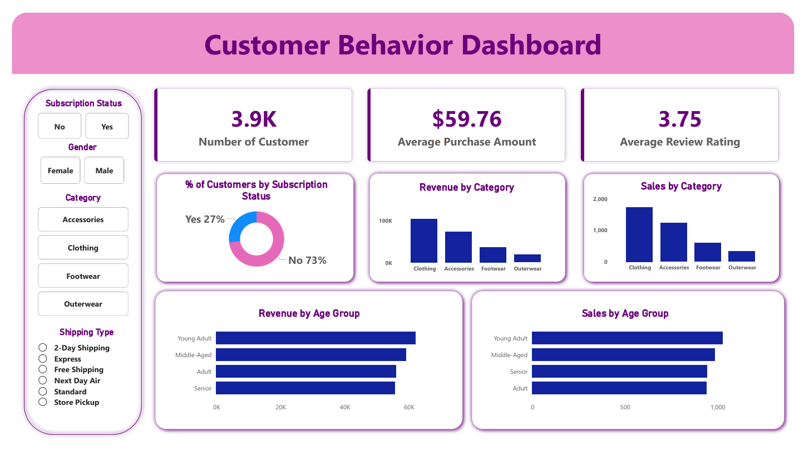

# 📊 Customer Behavior Analysis

## 🚀 Overview

End-to-end analysis of customer purchasing behavior using **Python, SQL, and Power BI**.

---

## 🛠️ Tech Stack

* Python (Pandas)
* SQL (PostgreSQL)
* Power BI

---

## 📊 Dashboard



---

## 📊 Key Insights

* Revenue by gender
* Discount vs spending behavior
* Customer segmentation (New, Returning, Loyal)
* Subscription vs non-subscription analysis
* Revenue by age group

---

## 📂 Structure

```
data/          
notebooks/     
sql/           
dashboard/     
```

---

## 👨‍💻 Author

Alokit Raj Sharma
